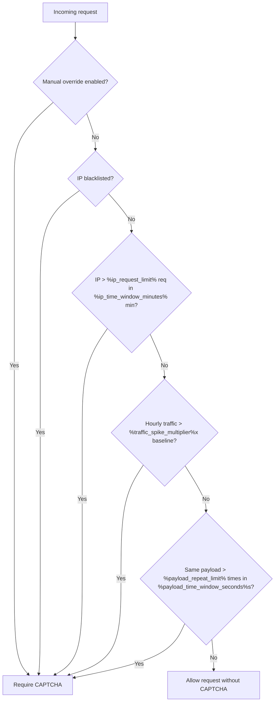

# CAPTCHA Decisioning Overview

<link-summary>Explains when CAPTCHA is shown, why each trigger exists, and how decisions are made.</link-summary>
<card-summary>Understand the five adaptive CAPTCHA triggers without reading backend code.</card-summary>
<web-summary>Reference article for non-developer specialists who need to explain or validate CAPTCHA behavior.</web-summary>

<primary-label ref="audience-nondev"/>
<secondary-label ref="security"/>
<secondary-label ref="stable"/>

%product% protects services from abusive traffic while reducing unnecessary friction for normal users.
Instead of showing a challenge on every interaction, the service evaluates requests against a set of rules.

<include from="lib.md" element-id="captcha-thresholds-snippet"/>

## Why adaptive CAPTCHA is used
<secondary-label ref="impact"/>

Always-on CAPTCHA can interrupt legitimate users and reduce retention.
Adaptive CAPTCHA is used to challenge only high-risk patterns:

- Bursts from one source.
- Requests from known-bad IP addresses.
- Sudden traffic anomalies.
- Repeated identical payloads.
- Manual enforcement during incidents.

## Rule reference
<secondary-label ref="stable"/>

| Rule | Trigger condition | Effect |
|---|---|---|
| High request rate from one IP | More than `%ip_request_limit%` requests from one IP in less than `%ip_time_window_minutes%` minutes | CAPTCHA is required for requests from that IP |
| IP in blacklist | Request IP exists in `%blacklist_source%` | CAPTCHA is required immediately |
| Hourly traffic spike | Current hour receives more than `%traffic_spike_multiplier%x` average hourly requests over the last `%traffic_baseline_period_days%` days | CAPTCHA is enabled for that hour bucket |
| Repeated payload pattern | Same payload sent more than `%payload_repeat_limit%` times in `%payload_time_window_seconds%` seconds | CAPTCHA is required for matching traffic |
| Manual override | Admin enables CAPTCHA for selected request scopes | CAPTCHA is required for the configured scope |

## Decision flow
<secondary-label ref="security"/>

## Request and challenge response
<secondary-label ref="impact"/>

Repeated payload request:

<code-block lang="json" src="../codeSnippets/requests/repeated-payload-request.json"/>

Typical challenge response:

<code-block lang="json" src="../codeSnippets/responses/captcha-challenge-response.json"/>

## What is intentionally not covered

- Backend implementation details and source code logic.
- CAPTCHA vendor internals.
- Final customer messaging copy.

<seealso style="cards" title="Next">
    <category ref="operations">
        <a href="CAPTCHA-Operations-Runbook.md" summary="Incident actions and escalation steps."/>
        <a href="CAPTCHA-Glossary.md" summary="Definitions for key terms used in this article."/>
    </category>
    <category ref="delivery">
        <a href="Documentation-Delivery-Setup.md" summary="How this documentation is built and published."/>
    </category>
</seealso>
